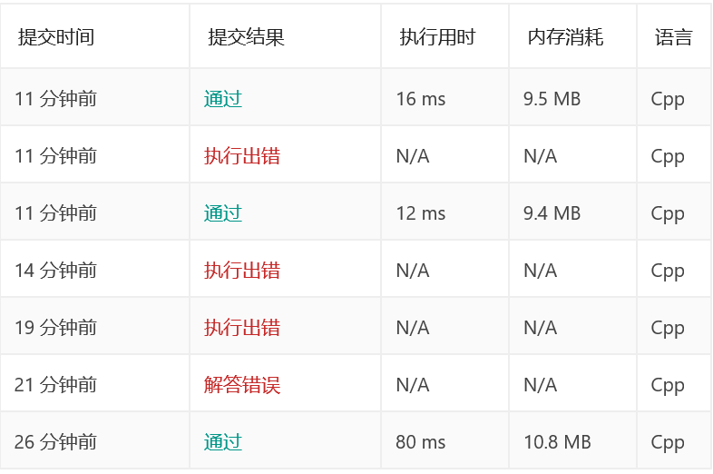

## 题目
在未排序的数组中找到第 k 个最大的元素。请注意，你需要找的是数组排序后的第 k 个最大的元素，而不是第 k 个不同的元素。

示例 1:

输入: [3,2,1,5,6,4] 和 k = 2
输出: 5


示例 2:

输入: [3,2,3,1,2,4,5,5,6] 和 k = 4
输出: 4

说明: 

你可以假设 k 总是有效的，且 1 ≤ k ≤ 数组的长度。

## 解答

这里借鉴了快排的思想，有人称之为快速选择。

快排中有一个很重要的步骤，就是每次调整第一个元素的位置，使得该元素的左侧比它小，右侧比它大，至于等于的放左边还是右边，实际上都可以。

看到这里，你是不是想到了分治？

没错，这道题完全可以利用快排中的这一步骤去减小数组的规模。

很快，我们就有了一个初始版本的解法

```cpp
class Solution {
public:
    int findKthLargest(vector<int>& nums, int k) {
        srand(time(NULL));
        return findKthLargest(nums, 0, nums.size() - 1, k - 1);
    }

    int findKthLargest(vector<int>& nums, int m, int n, int k) {
        if (m == n)
            return nums[m];
        int p = partition(nums, m, n);
        if (p == k)
            return nums[p];
        else if (p < k) {
            return findKthLargest(nums, p + 1, n, k);
        }
        else {
            return findKthLargest(nums, m, p - 1, k);
        }
    }

    int partition(vector<int>& nums, int p, int r) {
        //int pivot = (rand() % (r - p + 1)) + p;
        //swap(nums[pivot], nums[p]);
        int x = nums[p];
        int k = p;
        for (int i = p + 1; i <= r; i++) {
            if (nums[i] >= x) {
                swap(nums[i], nums[++k]);
            }
        }
        swap(nums[p], nums[k]);
        return k;
    }
};
```

### 小技巧

有没有注意到被注释掉那两行？直接选取第一个元素作为枢轴元素不就好了？

还记得快排的最坏时间复杂度是O(n2)吗？假如数组是有序的，每次规模只被减小了1！

通过随机选取枢轴元素，可以在很大程度上缓解这个问题。

不信？



注释的花了80ms，没注释的花了12ms

就到这里啦！